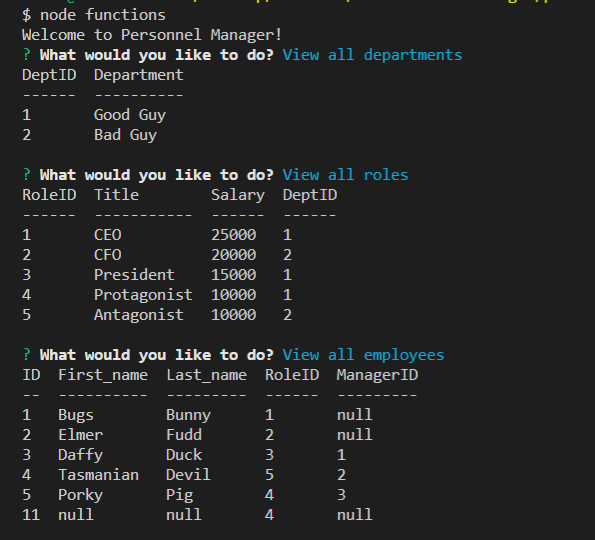

# Personnel Manager
  
  

  ## Description
  A command-line application for doing CRUD to your company's personnel database. This app uses MySQL Database Management System and NodeJS.

  ## Table of Contents
  * [**Installation**](#installation)
  * [**Usage**](#usage)
  * [**Contributing**](#contributing)
  * [**Tests**](#tests)
  * [**License**](#license)
  * [**Questions**](#questions)

  ## Installation
  Commands to run to install dependencies: npm install

  ## Usage
  Run the program by typing node functions into the command terminal.
  

  

  ## Contributing
  Contact me

  ## Tests
  Command to run tests: N/A

  ## License
  The contents of this repository are protected under the MIT license

  ## Questions
  Follow me on GitHub at https://github.com/LindseyM20

  Please contact me with any questions or feedback at lindsey.bordner@gmail.com 
